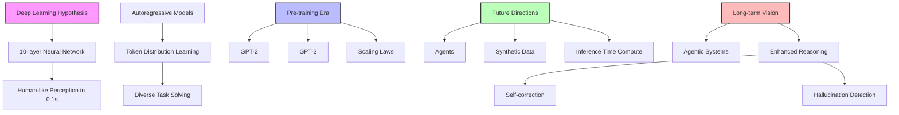

#ToDo: Overview of training phases E2E (pre-training to post-training)

#ToDo: I. Tokenization and vocabulary

II. Attention

#ToDo: Generate an image of the attention sequence

Building the attention mechanism incrementally:
A. Simplified self-attention
B. Self-attention
C. Causal attention
D. Multi-head attention

Need for attention "Encoder / decoder RNNs"
- Encoder processes the entire input sequence, thereby, incrementally building a hidden state that is supposed to capture the meaning of the entire input sequence
- Decoder generates an output incrementally, one token at a time, thereby, updating the hidden state at each step, carrying forward the context necessary to complete the decoding
- Limitation: Decoder only has access to a single, current hidden state; not accessible at different points throughout the encoding process -> struggle with long, complex sentences --> hidden state bottleneck before decoding starts

Information box on RNNs
- What is a memory cell? Keeps the hidden state.
- Bahdanau attention as a precursor to transformers

Original transformer architecture introduced in 2016 by XYZ: self-attention. When computing an embedding, each token in the input sequence can attent to all other tokens in the input sequence. Self refers to the fact that tokens take into account the tokens around them to yield an embedding.

A. Simplified (non-trainable) self-attention

We calculate context embeddings $z_i$ for each input token $x_i$. A set of weights for the Cartesian product of these two: weights $a_ii$.

#ToDo: visualize weights and tokens in a diagram

III. Putting it all together

